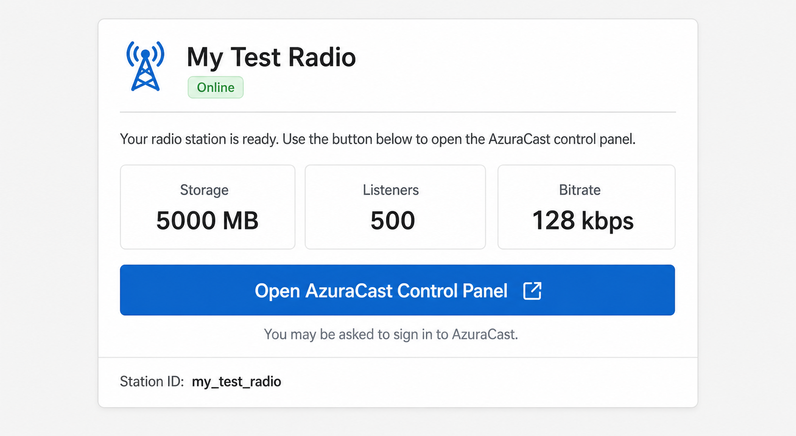

# AzuraCast for WHMCS

This module automatically creates and manages AzuraCast radio stations when customers purchase a WHMCS product.

## Client area preview



The panel automatically follows the active WHMCS theme. Colors and spacing may differ slightly from this preview.

## What it does

- Creates a radio station after payment
- Suspends and restores overdue services
- Deletes terminated services safely
- Changes storage, listener, and bitrate limits after an upgrade
- Adds Start, Stop, and Restart actions
- Shows customers a WHMCS-styled station panel and **Open AzuraCast Control Panel** button

## Before you start

You need:

1. WHMCS 7.2 or newer.
2. A working AzuraCast installation.
3. PHP cURL and JSON extensions on the WHMCS server.
4. An AzuraCast administrator API key.

### Create the AzuraCast API key

1. Sign in to AzuraCast as an administrator.
2. Click your user menu in the top-right corner.
3. Open **My API Keys**.
4. Create a key and copy it somewhere safe.

The key uses the permissions of its AzuraCast user. That user must be allowed to manage stations.

## Easy installation

### 1. Upload the module

Upload the complete `azuracast` folder to this location inside WHMCS:

```text
modules/servers/azuracast/
```

After uploading, these two files must exist:

```text
modules/servers/azuracast/azuracast.php
modules/servers/azuracast/clientarea.tpl
```

Do not upload only the PHP file—the customer panel needs `clientarea.tpl` too.

### 2. Add your AzuraCast server

1. Sign in to the WHMCS admin area.
2. Open **System Settings > Servers**.
3. Click **Add New Server**.
4. Enter any friendly name, such as `AzuraCast Radio Server`.
5. Enter your AzuraCast domain in **Hostname**, for example `radio.example.com`.
6. Select **AzuraCast** as the module.
7. Paste the API key into **Password**.
8. Enable **Secure** and use port `443` if AzuraCast uses HTTPS.
9. Leave the module Username field empty.
10. Click **Test Connection**.
11. Save only after WHMCS reports a successful connection.

Important: the Password box must contain the API key—not your normal AzuraCast password. Do not add `/api` to the hostname.

### 3. Create a WHMCS product

1. Open **System Settings > Products/Services**.
2. Create a product or edit an existing one.
3. Open **Module Settings**.
4. Select **AzuraCast**.
5. Select the AzuraCast server you added.
6. Choose the package limits:
   - **Storage Limit:** megabytes; `0` means unlimited.
   - **Maximum Listeners:** `0` means unlimited.
   - **Maximum Bitrate:** kbps; `0` means unlimited.
   - **Frontend:** choose Icecast unless you specifically need Shoutcast.
   - **Time Zone:** use a value such as `Europe/Amsterdam` or `America/New_York`.
7. Choose when WHMCS should automatically provision the service.
8. Save the product.

### 4. Test with one order

Before selling publicly:

1. Place a test order for the product.
2. Accept the order and run **Create** from the service page if it was not created automatically.
3. Confirm the station appears in AzuraCast.
4. Open the service as the customer and click **Open AzuraCast Control Panel**.
5. Test Suspend, Unsuspend, Start, Stop, and Restart.
6. Use a disposable station when testing Terminate because termination permanently deletes it.

## Customer experience

The service page uses WHMCS/Bootstrap theme classes, so it follows the colors and spacing of the active WHMCS theme. It displays:

- station name and online status
- storage, listener, and bitrate limits
- a large control-panel button
- useful connection errors without exposing the API key

The button opens the correct AzuraCast station page. Customers still need a legitimate AzuraCast login; the old module's passwordless station-login endpoint never existed.

## Existing services from the old module

The old module did not store station IDs. For each old service, either:

1. remove the old manually-created station and run **Create** again; or
2. create a hidden WHMCS product custom field named `AzuraCast Station ID` and enter the station's numeric AzuraCast ID.

Verify every imported ID before using Terminate. Termination permanently deletes the station attached to that ID.

## Troubleshooting

### Test Connection fails

- Check that the hostname contains no `/api` path.
- Check that **Secure** matches HTTP/HTTPS.
- Confirm port `443` for normal HTTPS installations.
- Generate a new API key and paste it into the WHMCS server Password field.
- Confirm the API-key user can manage stations.

### The module is not listed

- Confirm the folder is named exactly `azuracast`.
- Confirm the main file is exactly `azuracast.php`.
- Confirm WHMCS can read both files.

### A command fails

Open **Utilities > Logs > Module Log** in WHMCS. Enable module debugging temporarily, repeat the action, and inspect the AzuraCast response. Disable debugging afterward because responses can contain operational station information.

Your AzuraCast installation also publishes version-matched API documentation at `https://your-azuracast-host/api`.

## Security

- Always use HTTPS with a valid TLS certificate.
- Give the API-key user only the permissions it needs.
- The module never disables TLS verification.
- API redirects are not followed, so credentials cannot be forwarded to another host.
- Destructive actions use the numeric station ID saved during provisioning, never a customer-controlled station name.
